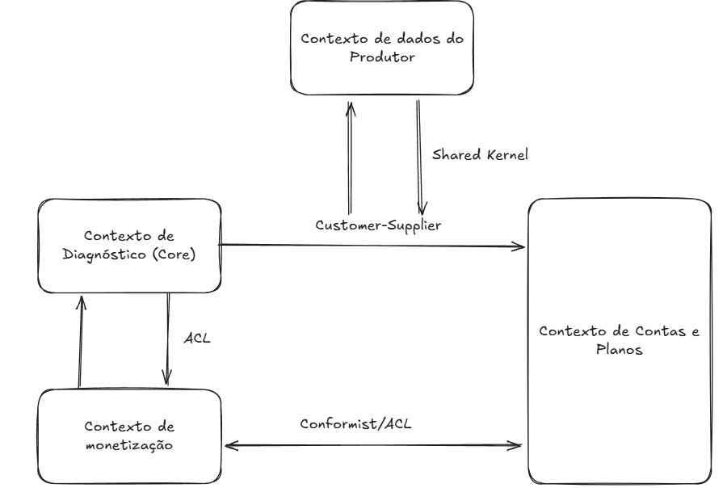

# Mapeamento de contextos
## 1. Nome do Projeto
**Green AI**

## 2. Tabela de relacionamento

| **Origem**                    | **Destino**                   | **Tipo de Relacionamento** | **Explicação**                                                                                                                             |
| ----------------------------- | ----------------------------- | -------------------------- | ------------------------------------------------------------------------------------------------------------------------------------------ |
| Contexto de Diagnóstico       | Contexto de Contas e Planos   | Customer-Supplier          | O Diagnóstico depende do Contas e Planos para validar se o usuário pode acessar a IA (limite de uso e plano contratado).                   |
| Contexto de Diagnóstico       | Contexto de Dados do Produtor | Customer-Supplier          | O histórico de diagnósticos precisa ser persistido e consumido pelo módulo de relatórios.                                                  |
| Contexto de Diagnóstico       | Contexto de Monetização       | Anticorruption Layer (ACL) | O Diagnóstico emite eventos que podem influenciar publicidade/monetização, mas não deve ser impactado diretamente pelo modelo de anúncios. |
| Contexto de Contas e Planos   | Contexto de Monetização       | Customer-Supplier          | O Monetização depende do Contas e Planos para saber quem deve pagar e qual plano contratar.                                                |
| Contexto de Monetização       | Contexto de Contas e Planos   | Conformist                 | O Contas e Planos recebe eventos de confirmação de pagamento sem alterar seu modelo.                                                       |
| Contexto de Monetização       | Contexto de Diagnóstico       | Anticorruption Layer (ACL) | Monetização pode usar informações de diagnóstico para segmentar publicidade, mas sem acoplar-se ao modelo central da IA.                   |
| Contexto de Dados do Produtor | Contexto de Diagnóstico       | Shared Kernel              | Ambos precisam compartilhar entidades (por exemplo, "Diagnóstico") para garantir consistência de dados.                                    |

## 3. Diagrama

## 4. Justificativa
**Diagnóstico: Contas e Planos (Customer-Supplier):**
O Diagnóstico é o core domain, mas precisa consumir regras de plano (quantidade de diagnósticos liberados, premium/básico). Aqui o Contas e Planos atua como supplier.

**Diagnóstico: Dados do Produtor (Customer-Supplier + Shared Kernel):**
O Diagnóstico gera o dado (resultado da IA), mas o histórico/relatórios são mantidos no Dados do Produtor. Eles compartilham o mesmo conceito de "Diagnóstico" - justificando o Shared Kernel.

**Diagnóstico: Monetização (ACL):**
Monetização pode usar os resultados de diagnósticos (ex.: exibir propaganda de pesticida se detectar praga X). Porém, para não poluir o modelo do core com publicidade, colocamos uma Anticorruption Layer.

**Contas e Planos: Monetização (Customer-Supplier / Conformist):**
O Contas e Planos inicia o processo de pagamento - aqui Monetização é supplier.
Após a confirmação, Monetização apenas informa "Pagamento realizado", sem impor seu modelo - Conformist.