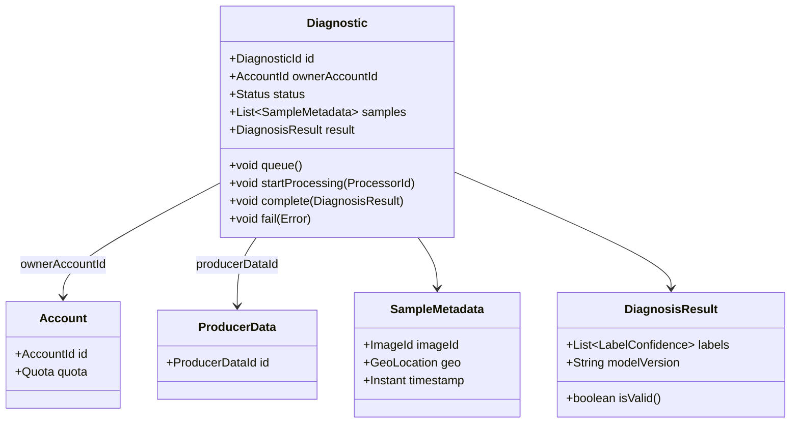

# Trabalho — Design Tático no DDD (Green AI)

---

# 1) Sobre o Domínio Escolhido
**Nome do domínio:** Green AI  
**Objetivo do sistema:** Fornecer diagnósticos agronômicos (pragas, doenças, estresse hídrico, nutrição) via modelos de IA, respeitando limites de uso por plano e garantindo histórico confiável para relatórios e monetização.  
**Principais atores:** Produtor (agricultor), Técnico Agrônomo, Sistema de Contas & Planos (billing), Sistema de Monetização (ads/payments), Sistema de Dados do Produtor (armazenamento/relatórios).

**Contextos (bounded):**
- Diagnóstico (core domain)
- Contas & Planos (autorização e limites)
- Dados do Produtor (histórico e relatórios)
- Monetização (pagamentos e publicidade)

---

# 2) Entidades vs Value Objects

| Elemento | Tipo (Entidade/VO) | Por quê? (identidade/imutável) |
|---|---|---|
| **Diagnóstico** | Entidade (Aggregate Root) | Identidade por `diagnosticId`. Representa processo com lifecycle (estados). |
| **Amostra (Sample/ImageMetadata)** | Entidade leve (ou VO com id externo) | Se tratamos a imagem como artefato versionado: pode ter id; mas metadata (timestamp, coords) é VO imutável. |
| **Resultado (DiagnosisResult)** | VO (imutável) | Resultado do modelo — igualdade por valor (mesmos labels/confidences = mesmo VO). |
| **Money (Price, Credits)** | VO (imutável) | Representa credits/price — igualdade por valor, sem identidade. |
| **GeoLocation** | VO (imutável) | Latitude/longitude, imutável, comparável por valor. |
| **LimiteDeUso (Quota)** | Entidade (se mutável/por conta) ou VO | Se quota gerenciada globalmente por account, é entidade em outro agregado; se apenas snapshot, é VO. |

---

# 3) Agregados e Aggregate Root (AR)

**Agregado Principal:** **DiagnosticAggregate**  
**AR:** `Diagnostic` ou `DiagnosticAR`

**Conteúdo interno do agregado (apenas o necessário para consistência local):**
- `DiagnosticId`: VO/ID
- `OwnerAccountId`: referência por ID a Contas & Planos
- `List<SampleMetadata>`: VOs imutáveis — timestamps, geo, imageId
- `DiagnosisResult`: VO — labels, confidences, version do modelo
- `Status`: enum: CREATED, QUEUED, PROCESSING, COMPLETED, FAILED, REVIEW_REQUESTED
- `AppliedRules`: lista de regras/invariantes efetivadas
- `Audit`: VO com createdAt, lastUpdatedBy

**Referências a outros agregados por ID:**
- `AccountId`: Contas & Planos — autorização/quota  
- `ProducerDataId`: Dados do Produtor — storage/historic reference  
- `PaymentId`: Monetização — opcional, para diagnósticos pagos  

**Boundary — Por que cada item está dentro/fora?**
- Dentro porque o `DiagnosisResult` e `Status` precisam de consistência transacional (não pode ter `COMPLETED` sem um resultado válido).  
- Dentro porque `SampleMetadata` e `Audit` são parte do ciclo do diagnóstico.  
- Fora: `Account` (há regras e quotas externas, mudança de plano não deve alterar histórico do diagnóstico localmente) — referência por ID e validação via chamada/consulta (consistência eventual).  
- Fora: Relatórios agregados e dashboards (DataProducer) — persistência separada/read models.  

---

# 4) Invariantes e Máquina de Estados

### Invariantes
1. **Owner deve ter quota disponível**: não criar/confirmar diagnóstico se a conta não tem crédito/limite.  
2. **Estado final só pode ser COMPLETED se existir `DiagnosisResult` válido**.  
3. **Não permitir reprocessamento concorrente**: um diagnóstico com `PROCESSING` não pode entrar em `PROCESSING` novamente.  
4. **Samples não sobrepostos invalidamente**: metadata com mesmo `imageId` não deve ser duplicado no mesmo diagnóstico.  
5. **Mudança de resultado após `COMPLETED` só por processo auditado**.  


### Estados e transições da AR `Diagnostic`
CREATED -> QUEUED -> PROCESSING -> COMPLETED
COMPLETED -> REVIEW_REQUESTED -> COMPLETED (reavaliado)
CREATED -> CANCELLED


**Regras:**
- **CREATED -> QUEUED**: permitida se `OwnerAccountId` existe e quota-check OK.  
- **QUEUED -> PROCESSING**: permitida se nenhum outro processamento ativo (lock) e modelo disponível.  
- **PROCESSING -> COMPLETED**: permitida se `DiagnosisResult` válido. Caso contrário -> FAILED.  
- **COMPLETED -> REVIEW_REQUESTED**: qualquer usuário autorizado pode pedir revisão.  
- **Qualquer transição para CANCELLED**: permitida se diagnóstico não estiver em PROCESSING.  

---

# 5) Repositório do Agregado (Java)

```java
public interface DiagnosticRepository {
    Optional<Diagnostic> findById(DiagnosticId id);
    void add(Diagnostic diagnostic);
    void save(Diagnostic diagnostic);
}
```

---

# 6) Eventos de Domínio

| Evento                          | Quando ocorre                              | Payload mínimo                                                 | Interno/Integração                       | Observações                                               |
| ------------------------------- | ------------------------------------------ | -------------------------------------------------------------- | ---------------------------------------- | --------------------------------------------------------- |
| **DiagnosticCreated**           | Ao criar um diagnóstico (pós-commit)       | `diagnosticId`, `ownerAccountId`, `createdAt`, `sampleIds`     | Interno / Integração (Dados do Produtor) | Publicar pós-commit; incluir `traceId` para idempotência. |
| **DiagnosticProcessingStarted** | Quando nó/processador inicia processamento | `diagnosticId`, `processorId`, `startedAt`                     | Interno                                  | Usado para locks e métricas.                              |
| **DiagnosticCompleted**         | Ao finalizar com sucesso                   | `diagnosticId`, `resultSummary`, `modelVersion`, `completedAt` | Interno / Integração                     | Consumidores: relatórios, monetização (via ACL).          |
| **DiagnosticFailed**            | Ao falhar processamento                    | `diagnosticId`, `errorCode`, `reason`, `failedAt`              | Interno                                  | Para alertas/triagem humana.                              |

---

# 8) Diagrama (Mermaid)


---

# 9) Checklist de Aceitação (resumo)

- [x] **VOs imutáveis** e com igualdade por valor (`GeoLocation`, `DiagnosisResult`, `Money`).  
- [x] **Boundary do agregado pequeno** — `Diagnostic` contém só o necessário.  
- [x] **Domínio rico**: operações como `queue`, `startProcessing`, `complete`, `requestReview`.  
- [x] **Repositório focado na AR** (sem `IQueryable`/detalhes de ORM no domínio).  
