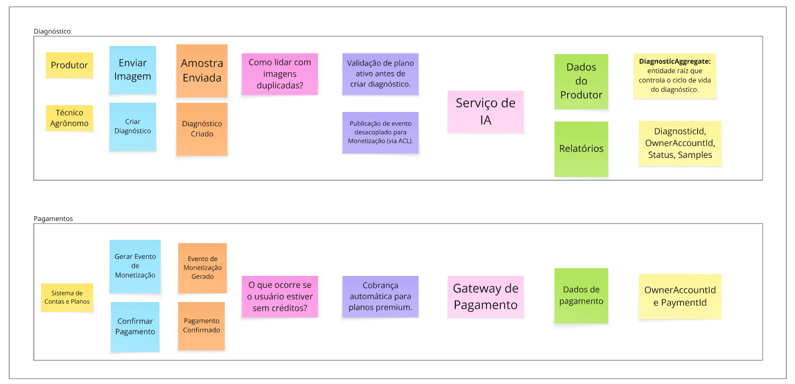

# 🌿 Green AI — Event Storming

## **1: Processo Central Escolhido**
**Processo:** Diagnóstico de Planta via Inteligência Artificial  

O fluxo representa desde o envio da imagem até o armazenamento do resultado e eventual monetização.

---

## **2: Eventos de Domínio**

| **Evento** | **Descrição** |
|-------------|----------------|
| Amostra Enviada | O produtor envia uma imagem da planta para análise. |
| Diagnóstico Criado | Um novo diagnóstico é registrado e entra na fila de processamento. |
| Processamento Iniciado | A IA inicia o processamento da amostra. |
| Diagnóstico Concluído | A IA retorna o resultado com a possível doença e nível de confiança. |
| Diagnóstico Falhou | O processamento não pôde ser concluído (erro técnico ou imagem inválida). |
| Diagnóstico Salvo no Histórico | O resultado é armazenado no contexto de Dados do Produtor. |
| Evento de Monetização Gerado | É criado um evento para exibir publicidade ou registrar cobrança do uso (plano premium). |
| Pagamento Confirmado | Monetização confirma o pagamento da assinatura ou uso adicional. |
| Relatório Atualizado | O diagnóstico concluído é adicionado ao relatório do produtor. |

---

## **3: Comandos e Atores**

| **Comando** | **Ator** | **Evento Gerado** |
|--------------|------------------|------------------|
| Enviar Imagem | Produtor | Amostra Enviada |
| Criar Diagnóstico | Sistema (Diagnóstico) | Diagnóstico Criado |
| Iniciar Processamento | Serviço de IA | Processamento Iniciado |
| Finalizar Diagnóstico | Serviço de IA | Diagnóstico Concluído / Diagnóstico Falhou |
| Salvar Histórico | Sistema (Dados do Produtor) | Diagnóstico Salvo no Histórico |
| Gerar Evento de Monetização | Sistema (Monetização) | Evento de Monetização Gerado |
| Confirmar Pagamento | Gateway de Pagamento | Pagamento Confirmado |
| Atualizar Relatório | Sistema (Dados do Produtor) | Relatório Atualizado |

---

## **4: Regras e Políticas de Negócio**

| **Regra / Política** | **Descrição / Condição** |
|-----------------------|--------------------------|
| Validação de plano ativo | Antes de criar um diagnóstico, verificar se o usuário tem crédito disponível. |
| Fila de processamento | Diagnósticos são processados em ordem FIFO, respeitando a carga da IA. |
| Diagnóstico só pode ser concluído com resultado válido | Não é permitido marcar como “COMPLETED” sem `DiagnosisResult`. |
| Reprocessamento bloqueado | Diagnósticos em `PROCESSING` não podem ser reenfileirados. |
| Cobrança automática | Diagnóstico premium aciona cobrança imediata via Monetização. |
| Evento de Monetização desacoplado | Diagnóstico envia evento sem depender diretamente do modelo de anúncios (ACL). |
| Histórico consistente | O Diagnóstico só é salvo no contexto de Dados do Produtor após confirmação de conclusão. |

---

## **5: Bounded Contexts Envolvidos**

| **Bounded Context** | **Responsabilidade** | **Eventos / Ações** |
|----------------------|----------------------|----------------------|
| Diagnóstico (Core Domain) | Processa imagens, gera resultados, controla estados. | Criado, Processamento Iniciado, Concluído, Falhou |
| Contas e Planos | Valida limites, planos e autorizações. | Validação de uso antes de criar diagnóstico |
| Monetização | Processa pagamentos e anúncios. | Evento de Monetização Gerado, Pagamento Confirmado |
| Dados do Produtor | Armazena históricos e relatórios. | Diagnóstico Salvo, Relatório Atualizado |

---

## **6: Fluxo Geral**

1. O **Produtor** envia uma imagem - gera **Amostra Enviada**.  
2. O **Contexto de Diagnóstico** cria uma nova análise - **Diagnóstico Criado**.  
3. A IA processa a imagem - **Processamento Iniciado** - **Diagnóstico Concluído**.  
4. O resultado é enviado ao **Dados do Produtor** - **Diagnóstico Salvo no Histórico**.  
5. O **Monetização** recebe um evento para registro/cobrança - **Evento de Monetização Gerado** - **Pagamento Confirmado**.  
6. O **Dados do Produtor** atualiza o **Relatório do Produtor** com o novo resultado. 